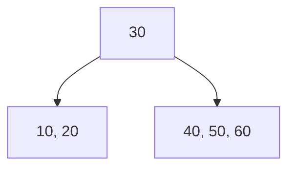
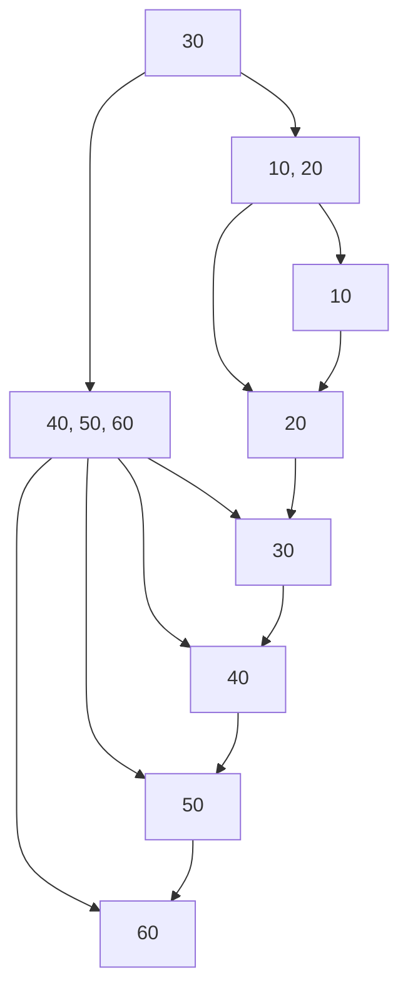

### B-树和 B+树的数据结构图示

#### B-树数据结构图示

B-树是一种自平衡的树数据结构，每个节点可以包含多个子节点。下图展示了一个简单的 B-树：

在这个例子中：

- 根节点包含一个键值 30，分为两个子节点。
- 左子节点包含键值 10 和 20。
- 右子节点包含键值 40、50 和 60。
- 所有叶子节点位于同一层。

#### B+树数据结构图示

B+树是一种 B-树的变体，所有数据都存储在叶子节点，而内部节点只存储索引。下图展示了一个简单的 B+树：

在这个例子中：

- 根节点包含一个索引键值 30，分为两个子节点。
- 内部节点包含索引键值 10、20 和 40、50、60。
- 所有数据存储在叶子节点，叶子节点包含键值 10、20、30、40、50 和 60。
- 叶子节点形成一个链表，用于顺序访问和范围查询。

### 数据结构特点

#### B-树
- **节点结构**：每个节点包含多个键值和子节点指针。
- **平衡性**：所有叶子节点位于同一层，保持树的高度平衡。
- **数据存储**：数据可以存储在内部节点和叶子节点。

#### B+树
- **节点结构**：内部节点只存储索引键值，叶子节点存储所有数据。
- **平衡性**：所有叶子节点位于同一层，保持树的高度平衡。
- **链表结构**：叶子节点形成链表，支持顺序访问和范围查询。
- **数据存储**：所有数据存储在叶子节点，内部节点只存储索引。

### 比较

- **查询性能**：B+树的叶子节点形成链表，顺序访问和范围查询性能优于 B-树。
- **插入/删除操作**：B+树的插入和删除操作可能会引起节点分裂和合并，但其平衡性和低树高减少了磁盘 I/O 操作。
- **存储效率**：B+树的内部节点只存储索引，叶子节点存储所有数据，存储效率较高。

### 总结

B-树和 B+树都是高效的平衡树数据结构，广泛应用于数据库系统。B+树由于其链表结构和高效的顺序访问，通常被用作数据库索引。了解它们的结构和特点，有助于优化数据库性能，选择合适的索引类型。

MySQL 索引广泛使用 B+ 树和 B- 树，因为这些树结构在处理大量数据的情况下具有高效的性能和灵活性。以下是关于 MySQL 索引使用 B+ 树和 B- 树的原因，以及它们与其他常用索引数据结构的比较。

### 为什么使用 B+ 树和 B- 树？

#### B-树
- **定义**：B-树是一种自平衡的树数据结构，在数据库和文件系统中被广泛使用。它可以保持数据的有序性，并允许对数据进行高效的插入、删除和查找操作。
- **特性**：
  - 每个节点可以有多个子节点。
  - 所有叶子节点位于同一层。
  - 具有平衡性，确保树的高度较低，从而减少磁盘 I/O 操作。
  
#### B+树
- **定义**：B+树是 B-树的一种变体，它的所有数据都存储在叶子节点，内部节点只存储索引。
- **特性**：
  - 叶子节点形成一个链表，支持范围查询和顺序访问。
  - 数据全部存储在叶子节点，内部节点只存储索引，减少了树的高度。
  - 更适合数据库的存储和检索需求，特别是顺序访问和范围查询。

### B+ 树和 B- 树的优缺点

#### 优点：
1. **高效的查询性能**：
   - B+ 树和 B- 树都能保持树的高度平衡，从而确保查找、插入和删除操作的时间复杂度为 O(log n)。
   - B+ 树的叶子节点形成链表，方便顺序访问和范围查询。
2. **低磁盘 I/O**：
   - B+ 树和 B- 树的节点通常可以容纳多个键值对，从而减少树的高度，减少磁盘 I/O 操作次数。
3. **良好的缓存命中率**：
   - B+ 树和 B- 树的扇出较大，树的高度较低，可以增加缓存命中率，提高查询性能。

#### 缺点：
1. **复杂的实现**：
   - 相比于哈希表等简单数据结构，B+ 树和 B- 树的实现更加复杂。
2. **更新操作的成本**：
   - 插入和删除操作可能会引起节点的分裂和合并，增加了一定的开销。

### 与其他常用索引数据结构的比较

#### 哈希表
- **优点**：
  - 等值查询性能非常高，时间复杂度为 O(1)。
  - 实现简单，适合快速查找特定值。
- **缺点**：
  - 不支持范围查询。
  - 哈希冲突处理复杂，可能影响性能。

#### 倒排索引
- **优点**：
  - 适用于全文搜索和文本数据检索。
  - 支持复杂的文本查询和词频统计。
- **缺点**：
  - 维护复杂，特别是插入和删除操作开销大。
  - 不适用于数值数据的等值和范围查询。

#### R-树（空间索引）
- **优点**：
  - 适合多维数据的存储和查询，如地理信息系统（GIS）。
  - 支持高效的空间查询，如范围查询和邻近查询。
- **缺点**：
  - 实现复杂，插入和删除操作开销较大。
  - 不适用于一维数据的常规查询。

#### 位图索引
- **优点**：
  - 适用于低基数列（列中唯一值较少）的高效查询。
  - 对布尔类型数据和低基数数据查询性能高。
- **缺点**：
  - 对于高基数列，位图索引会占用大量空间。
  - 适用于只读或少更新的环境，更新开销较大。

### 结论

B+ 树和 B- 树由于其平衡性和低磁盘 I/O 操作的特点，非常适合用于关系型数据库的索引结构。它们能够提供高效的等值查询、范围查询和顺序访问，兼顾了性能和灵活性。而其他数据结构，如哈希表、倒排索引、R-树和位图索引，虽然在特定场景下有其优势，但在通用性和综合性能上不如 B+ 树和 B- 树适合数据库系统的需求。